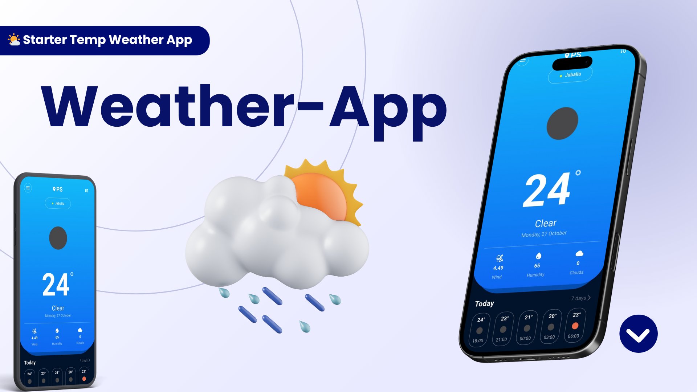

# 🌤️ Starter Temp Weather App

A sleek and lightweight Flutter application that provides real-time weather updates based on the user's current location or selected city. Built with simplicity, performance, and user experience in mind.

---

## 📌 Project Overview
Starter Temp Weather App is a cross-platform mobile application that fetches and displays current and hourly weather data using the OpenWeatherMap API. It supports both automatic location-based weather and manual country/city selection, making it ideal for travelers, weather enthusiasts, or anyone who wants quick access to weather updates.

---

## 🛠️ Tech Stack
- **Flutter** – UI toolkit for building natively compiled apps  
- **Dart** – Programming language used with Flutter  
- **OpenWeatherMap API** – For real-time weather data  
- **Geolocator** – To fetch device location  
- **Shared Preferences** – For local caching of weather data  
- **HTTP** – For making API requests  
- **country_state_city_picker** – For selecting country and city  

---

## 🧱 Architecture
The app follows a modular architecture with clear separation of concerns:  
- **Models:** Represent weather and location data  
- **Helpers:** Handle networking, constants, and color themes  
- **Screens:** UI components and user interaction  
- **Services:** API integration and location handling  

This structure ensures scalability, maintainability, and testability.

---

## ✨ Features
- 🌍 Get weather based on current location  
- 🏙️ Search weather by country and city  
- 🌡️ View temperature, humidity, wind, and cloud coverage  
- 🕒 Hourly weather forecast  
- 💾 Offline support via local caching  
- 🎨 Custom color themes for better UX  
- 📱 Android and iOS support  

---

## 🚀 How to Run the Project
1. **Clone the repository**  
- git clone https://github.com/a7med2002/start_weather_app.git

2. **Install dependencies** 
- flutter pub get

3.	**Add your OpenWeatherMap API key**
- Replace the value in : lib/helper/constants.dart
- const String apiKey = "YOUR_API_KEY_HERE";

4. **Run the app**
- flutter run

## 🖼️ Screenshots

## 🌐 Social Links
- 👨‍💻 Developer: [ِAhmed Meqdad]
- 📧 Email: [ahmd2002mqdad@gamil.com]
- 💼 LinkedIn: [linkedin.com/in/ahmed-meqdad](https://www.linkedin.com/in/ahmed-meqdad)
